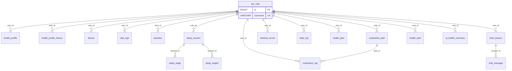

# HealthHyper 数据库设计说明

本文档依据 `src/main/resources/schema.sql` 整理，描述当前 Spring Boot 演示服务使用的 **H2（开发）/ MySQL（生产）** 兼容表结构。库中 **未声明外键**，关联关系由应用层通过 `user_id` 等字段维护。

---

## 1. 总览图（逻辑 ER）

---

## 2. 表清单（按业务域）

| 域 | 表名 | 说明 |
|----|------|------|
| 账号 | `sys_user` | 登录用户 |
| 档案 | `health_profile`、`health_profile_history` | 当前健康档案、历史快照 |
| 设备 | `device` | 绑定设备；`device_sn` 可与 IoTDA 设备 ID 对齐 |
| 生理 | `vital_sign` | 体征上传（含 IoT/蓝牙来源） |
| 基线 | `baseline` | 个人基线（可由设备影子同步） |
| 睡眠 | `sleep_session`、`sleep_stage`、`sleep_stage2` | 睡眠会话与阶段明细（两套阶段模型） |
| 用药 | `medication_plan`、`medication_log` | 用药计划与服药记录 |
| 医疗 | `medical_record` | 病历/报告元数据与 OCR 文本 |
| 日常 | `daily_log` | 日记与心情 |
| 计划 | `health_plan` | 健康计划（JSON 条目） |
| 对话 | `chat_session`、`chat_message` | AI 会话与消息 |
| 告警 | `health_alert` | 健康告警（列表接口通常限最近条数） |
| 摘要 | `ai_health_summary` | AI 生成的健康摘要 |

---

## 3. 各表字段与索引

### 3.1 `sys_user`

| 列 | 类型 | 约束 | 说明 |
|----|------|------|------|
| `id` | BIGINT | PK, AUTO | |
| `username` | VARCHAR(64) | NOT NULL, UNIQUE | 登录名 |
| `password_hash` | VARCHAR(255) | NOT NULL | 密码哈希 |
| `nickname` | VARCHAR(64) | | 昵称 |
| `avatar_url` | VARCHAR(512) | | 头像 URL |
| `phone` | VARCHAR(32) | | 手机号 |
| `created_at` | TIMESTAMP | DEFAULT CURRENT_TIMESTAMP | |
| `updated_at` | TIMESTAMP | ON UPDATE | |

**索引**：`username` UNIQUE。

---

### 3.2 `health_profile`

| 列 | 类型 | 说明 |
|----|------|------|
| `id` | BIGINT PK | |
| `user_id` | BIGINT NOT NULL, UNIQUE | 一用户一行当前档案 |
| `gender` | VARCHAR(16) | |
| `birth_date` | DATE | |
| `height_cm` | DOUBLE | |
| `weight_kg` | DOUBLE | |
| `blood_type` | VARCHAR(8) | |
| `allergies` | VARCHAR(512) | |
| `chronic_diseases` | VARCHAR(512) | |
| `medications` | VARCHAR(512) | |
| `notes` | VARCHAR(1024) | |
| `created_at` / `updated_at` | TIMESTAMP | |

**索引**：`user_id` UNIQUE。

---

### 3.3 `health_profile_history`

档案变更历史（INSERT 新行，不覆盖旧行）。

| 列 | 类型 | 说明 |
|----|------|------|
| `id` | BIGINT PK | |
| `user_id` | BIGINT NOT NULL | |
| `snapshot_json` | CLOB | 档案快照 JSON |
| `change_reason` | VARCHAR(255) | |
| `created_at` | TIMESTAMP | |

**索引**：`idx_profile_hist_user (user_id, created_at)`。

---

### 3.4 `device`

| 列 | 类型 | 说明 |
|----|------|------|
| `id` | BIGINT PK | |
| `user_id` | BIGINT NOT NULL | |
| `device_type` | VARCHAR(32) | 如 RING、WATCH |
| `device_sn` | VARCHAR(64) | 序列号；**可与华为 IoTDA `device_id` 一致**便于影子同步 |
| `device_name` | VARCHAR(64) | |
| `last_sync_at` | TIMESTAMP | |
| `created_at` | TIMESTAMP | |

**索引**：`idx_device_user (user_id)`；`device_sn` UNIQUE（全表唯一）。

---

### 3.5 `vital_sign`

体征数据；数值列多为 `DOUBLE`，兼容 H2/MySQL。

| 列 | 类型 | 说明 |
|----|------|------|
| `id` | BIGINT PK | |
| `user_id` | BIGINT NOT NULL | |
| `device_id` | BIGINT | 关联 `device.id`，可空 |
| `recorded_at` | TIMESTAMP NOT NULL | 测量时间 |
| `heart_rate` / `hrv` / `spo2` / `steps` / `stress` / `body_temp` / `sleep_score` | DOUBLE | |
| `blood_pressure_sys` / `blood_pressure_dia` | INT | 收缩压/舒张压 |
| `blood_glucose` / `blood_glucose_type` | DOUBLE / VARCHAR(16) | 血糖及类型（空腹/餐后等） |
| `sleep_duration_min` | INT | |
| `respiratory_rate` | DOUBLE | 呼吸频率 |
| `source` | VARCHAR(32) | 如 **IOTDA**、BLUETOOTH |
| `turn_out` | DOUBLE | 翻身/离床等派生指标（依业务定义） |
| `created_at` | TIMESTAMP | |

**索引**：`idx_vital_user_time (user_id, recorded_at)`。

---

### 3.6 `baseline`

个人基线（如静息心率等）；可由 **IoTDA 设备影子** 回写 `updated_at`。

| 列 | 类型 | 说明 |
|----|------|------|
| `id` | BIGINT PK | |
| `user_id` | BIGINT NOT NULL, UNIQUE | 一用户一行 |
| `resting_hr` / `avg_hrv` / `avg_spo2` / `avg_steps` | DOUBLE | |
| `avg_sleep_hours` | DOUBLE | |
| `blood_pressure_sys_avg` / `blood_pressure_dia_avg` | INT | |
| `updated_at` | TIMESTAMP | |

---

### 3.7 `sleep_session`

一次睡眠会话主表。

| 列 | 类型 | 说明 |
|----|------|------|
| `id` | BIGINT PK | |
| `user_id` | BIGINT NOT NULL | |
| `device_id` | BIGINT | |
| `start_time` / `end_time` | TIMESTAMP NOT NULL | |
| `total_minutes` / `deep_minutes` / `light_minutes` / `rem_minutes` / `awake_minutes` | INT | 传统四阶段分钟数 |
| `sleep_score` | INT | |
| `source` | VARCHAR(32) | |
| `created_at` | TIMESTAMP | |

**索引**：`idx_sleep_user_start (user_id, start_time)`。

**说明**：若存在 `sleep_stage2` 明细，API 可返回 **`stage2_pct`**（按分钟占比），与下表阶段划分一致。

---

### 3.8 `sleep_stage`（传统阶段）

与主表 `deep/light/rem/awake` 对应的**时间段**明细。

| 列 | 类型 | 说明 |
|----|------|------|
| `id` | BIGINT PK | |
| `session_id` | BIGINT NOT NULL | → `sleep_session.id` |
| `stage_type` | VARCHAR(16) | DEEP / LIGHT / REM / AWAKE |
| `start_offset_sec` / `end_offset_sec` | INT | 相对会话开始的秒偏移 |
| `created_at` | TIMESTAMP | |

**索引**：`idx_sleep_stage_session (session_id)`。

---

### 3.9 `sleep_stage2`（扩展阶段）

更细粒度阶段（如清醒、浅睡、深睡、REM），用于 **`POST /api/sleep/upload2`** 等新接口。

| 列 | 类型 | 说明 |
|----|------|------|
| `id` | BIGINT PK | |
| `session_id` | BIGINT NOT NULL | → `sleep_session.id` |
| `stage_type` | VARCHAR(32) | 如 AWAKE, LIGHT, DEEP, REM（以业务枚举为准） |
| `start_offset_sec` / `end_offset_sec` | INT | |
| `created_at` | TIMESTAMP | |

**索引**：`idx_sleep_stage2_session (session_id)`。

---

### 3.10 `medication_plan`

| 列 | 类型 | 说明 |
|----|------|------|
| `id` | BIGINT PK | |
| `user_id` | BIGINT NOT NULL | |
| `drug_name` | VARCHAR(128) NOT NULL | |
| `dosage` | VARCHAR(64) | |
| `frequency` | VARCHAR(64) | |
| `reminder_times` | VARCHAR(255) | 如逗号分隔时刻 |
| `start_date` / `end_date` | DATE | |
| `notes` | VARCHAR(512) | |
| `created_at` / `updated_at` | TIMESTAMP | |

**索引**：`idx_med_plan_user (user_id)`。

---

### 3.11 `medication_log`

| 列 | 类型 | 说明 |
|----|------|------|
| `id` | BIGINT PK | |
| `user_id` | BIGINT NOT NULL | |
| `plan_id` | BIGINT | → `medication_plan.id`，可空 |
| `drug_name` | VARCHAR(128) NOT NULL | |
| `taken_at` | TIMESTAMP NOT NULL | |
| `dosage` | VARCHAR(64) | |
| `notes` | VARCHAR(255) | |
| `created_at` | TIMESTAMP | |

**索引**：`idx_med_log_user_time (user_id, taken_at)`。

---

### 3.12 `medical_record`

| 列 | 类型 | 说明 |
|----|------|------|
| `id` | BIGINT PK | |
| `user_id` | BIGINT NOT NULL | |
| `title` | VARCHAR(255) | |
| `record_type` | VARCHAR(64) | 化验单、影像等 |
| `hospital` | VARCHAR(128) | |
| `record_date` | DATE | |
| `file_url` | VARCHAR(512) | |
| `ocr_text` | CLOB | OCR 全文 |
| `summary` | VARCHAR(1024) | |
| `created_at` | TIMESTAMP | |

**索引**：`idx_medical_user_date (user_id, record_date)`。

---

### 3.13 `daily_log`

| 列 | 类型 | 说明 |
|----|------|------|
| `id` | BIGINT PK | |
| `user_id` | BIGINT NOT NULL | |
| `log_date` | DATE NOT NULL | |
| `content` | CLOB | |
| `mood` | VARCHAR(32) | |
| `created_at` / `updated_at` | TIMESTAMP | |

**索引**：`idx_daily_user_date (user_id, log_date)`。

---

### 3.14 `health_plan`

| 列 | 类型 | 说明 |
|----|------|------|
| `id` | BIGINT PK | |
| `user_id` | BIGINT NOT NULL | |
| `title` | VARCHAR(255) | |
| `items_json` | CLOB | 计划条目 JSON |
| `source` | VARCHAR(64) | 如 AI_CHAT |
| `chat_session_id` | BIGINT | → `chat_session.id` |
| `status` | INT DEFAULT 1 | **注释**：0=进行中，1=已完成 |
| `start_date` / `end_date` | DATE | |
| `created_at` | TIMESTAMP | |

**索引**：`idx_plan_user (user_id)`。

---

### 3.15 `chat_session`

| 列 | 类型 | 说明 |
|----|------|------|
| `id` | BIGINT PK | |
| `user_id` | BIGINT NOT NULL | |
| `title` | VARCHAR(255) | |
| `created_at` / `updated_at` | TIMESTAMP | |

**索引**：`idx_chat_sess_user (user_id)`。

---

### 3.16 `chat_message`

| 列 | 类型 | 说明 |
|----|------|------|
| `id` | BIGINT PK | |
| `session_id` | BIGINT NOT NULL | → `chat_session.id` |
| `role` | VARCHAR(16) NOT NULL | user / assistant / system |
| `content` | CLOB NOT NULL | |
| `created_at` | TIMESTAMP | |

**索引**：`idx_chat_msg_session (session_id, created_at)`。

---

### 3.17 `health_alert`

| 列 | 类型 | 说明 |
|----|------|------|
| `id` | BIGINT PK | |
| `user_id` | BIGINT NOT NULL | |
| `alert_type` | VARCHAR(64) NOT NULL | 如 VITAL_ANOMALY |
| `severity` | VARCHAR(16) | INFO / WARN / CRITICAL |
| `title` | VARCHAR(255) | |
| `message` | VARCHAR(1024) | |
| `related_data` | CLOB | JSON 附加信息 |
| `is_read` | BOOLEAN DEFAULT FALSE | |
| `created_at` | TIMESTAMP | |

**索引**：`idx_alert_user_time (user_id, created_at)`。

**说明**：列表接口当前实现为按 `created_at` 倒序 **最多 20 条**（`HealthAlertService` 中 `LIMIT 20`）。

---

### 3.18 `ai_health_summary`

| 列 | 类型 | 说明 |
|----|------|------|
| `id` | BIGINT PK | |
| `user_id` | BIGINT NOT NULL | |
| `summary_type` | VARCHAR(32) NOT NULL | DAILY / WEEKLY |
| `content` | CLOB NOT NULL | |
| `period_start` / `period_end` | DATE | |
| `created_at` | TIMESTAMP | |

**索引**：`idx_summary_user_period (user_id, summary_type, period_start)`。

---

## 4. 与应用的约定摘要

1. **用户主键**：绝大多数业务表通过 `user_id` 指向 `sys_user.id`（Java 实体 `User` 表名为 `sys_user`）。
2. **设备与 IoT**：`device.device_sn` 建议与云端 **IoTDA deviceId** 一致，便于拉取属性/影子并回写 `baseline`。
3. **体征来源**：`vital_sign.source` 区分 **IOTDA**（云端同步）与 **BLUETOOTH**（直连）等。
4. **睡眠双模型**：`sleep_stage` 服务旧版四阶段；`sleep_stage2` + `upload2` 服务新版阶段与 `stage2_pct` 统计。
5. **无物理外键**：删除用户需在应用层级联或接受孤儿数据策略（当前 schema 未定义 ON DELETE）。

---

## 5. 变更追溯

`schema.sql` 文件末尾含迁移说明注释（如 `baseline` 影子、`vital_sign` 字段调整、`sleep_stage2` 新增等）。以仓库中 **最新 `schema.sql`** 为准；若生产 MySQL 已手动演进，请与此文档对照补差。
